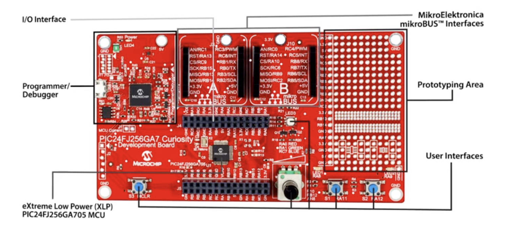

# Snake Game (Embedded, PIC24FJ256GA705)

Tilt-controlled Snake game running on a **PIC24FJ256GA705** microcontroller with a **96×96 OLED display** and an **I²C accelerometer**.  
The game lasts 60 seconds, supports horizontal scrolling with a potentiometer, and displays the score at the end.

## 🚀 Features

- Classic Snake gameplay on a **192×96 playfield** (96×96 visible window).
- **Tilt control** with accelerometer (move snake head).
- **Potentiometer scrolling** for horizontal playfield navigation.
- **Green charms** grow the snake; **red charms** shrink it.
- Game ends after **60 seconds** → score displayed.

## 🛠 Hardware

- MCU: Microchip PIC24FJ256GA705
- Display: 96×96 OLED (SPI/I²C)
- Sensor: I²C Accelerometer
- Control: Potentiometer (ADC input)
- Toolchain: MPLAB X IDE + XC16

## 📂 Repository Structure

```
snake-embedded-pic24/
├─ README.md
├─ docs/
│  ├─ operating_instructions.pdf
├─ firmware/
│  └─ I2C_Accel_Driver.X/
│     ├─ DemoAccel.c
│     ├─ Accel_i2c.c / Accel_i2c.h
│     ├─ oledDriver/
│     ├─ i2cDriver/
│     ├─ spiDriver/
│     ├─ System/
│     ├─ nbproject/
│     └─ Makefile
```

## 🔧 Build & Flash

1. Open MPLAB X IDE → **Open Project** → `I2C_Accel_Driver.X`.
2. Select device **PIC24FJ256GA705** and your programmer/debugger.
3. Build and program the board.
4. Tilt to steer, use potentiometer to scroll horizontally.

## 🎮 Gameplay

- Playfield: 192×96, OLED window: 96×96.
- **Green charms = grow**; **Red charms = shrink**.
- Timer: 60 s. Final score = snake length.

## 📖 Operating Instructions

Required Equipment:

- Microchip PIC24FJ256GA705
- OLED 96×96
- Accelerometer chip

Instructions:

1. Connect the OLED component to the microchip in mikroBUS A. (See (1) in the appendix below).
2. Connect the Accelerometer component to the microchip in mikroBUS B. (See (2) in the appendix below).
3. Connect the microchip to the computer.
4. Run the program in the appropriate IDE – MPLAB X IDE.
5. The game runs for 60 seconds, after which a message is displayed to the user with the final result: the length of the snake achieved at the end of the game.
6. During gameplay:
   a) Control the direction of the snake’s movement by tilting the screen.
   b) The screen can be moved (on the X axis) by rotating the potentiometer. (See (3) in the appendix below).
   c) The symbols marked '@' are charms that the snake eats, in green and red colors.
   d) When the snake eats a green charm – it lengthens by 1 segment.
   e) When the snake eats a red charm – it shortens by 1 segment.



## 📖 Documentation

- [Operating Instructions (PDF)](docs/operating_instructions.pdf)

## 📌 Credits

Developed as part of **Intro to Embedded Systems** coursework.
